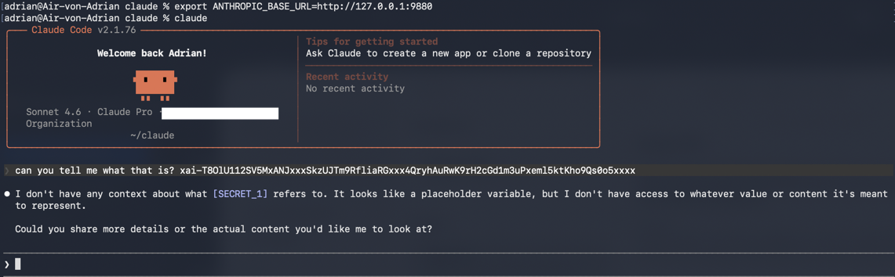
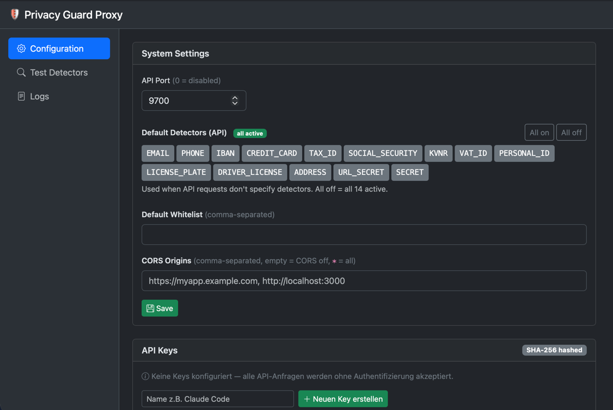

# privacy-guard-proxy

A local proxy that sits between [Claude Code](https://claude.ai/code) and the Anthropic API and automatically masks PII in every request before it leaves your machine.

Names, email addresses, IBANs, API keys, and other sensitive data are replaced with placeholders like `[EMAIL_1]` or `[IBAN_1]` — Claude never sees the real values.

No external service required — all detection runs in-process.



## How it works

```
Claude Code  →  privacy-guard-proxy (PII masking, built-in)  →  Anthropic API
```

Every outgoing request is intercepted. User messages, tool results, and file contents are scanned and anonymised before being forwarded upstream. Responses are passed through unchanged.


## Quick start

### Binary

```bash
# 1. Build
go build -o privacy-guard-proxy .

# 2. Start
./privacy-guard-proxy

# 3. Point Claude Code at the proxy
export ANTHROPIC_BASE_URL=http://127.0.0.1:9880
claude
```

### Docker

```bash
docker compose up -d
```

The proxy listens on `:9880` (Claude Code) and `:9881` (Web UI + REST API).

## Web UI


When `api_port` is configured, a browser UI is available at `http://localhost:9881`.

**First login:** `admin` / `admin` — you will be redirected to change the password immediately.

The UI allows you to:
- Configure proxy instances, detectors, and whitelists
- Enable per-proxy `dry_run` mode (detect + log without rewriting request bodies)
- Manage API keys (SHA-256 hashed, never stored in plaintext)
- Set default detectors and whitelist for the REST API
- Configure CORS origins for the REST API
- View live proxy logs per instance
- Test detectors interactively

## REST API

```bash
# Anonymise text
curl http://localhost:9881/anonymize \
  -H "Content-Type: application/json" \
  -d '{"text": "Meine IBAN: DE89370400440532013000"}' | jq

# Full scan with findings + mapping
curl http://localhost:9881/scan \
  -H "Content-Type: application/json" \
  -d '{"text": "foo@example.com, +49 171 1234567"}' | jq

# Selective detectors per request
curl http://localhost:9881/scan \
  -d '{"text": "...", "detectors": ["EMAIL", "IBAN", "SECRET"]}' | jq

# Health check
curl http://localhost:9881/health

# Prometheus-style metrics
curl http://localhost:9881/metrics
```

API key authentication (optional — when no keys are configured, all requests are accepted):

```bash
curl http://localhost:9881/scan \
  -H "X-Api-Key: pgk_..." \
  -d '{"text": "..."}'
```

Rate limiting: `/scan` and `/anonymize` are limited to `120` requests/minute per API key (or per client IP when no key is used).

## Configuration

`config.json`:

```json
{
  "api_port": 9881,
  "cors_origins": [],
  "default_detectors": [],
  "default_whitelist": [],
  "api_keys": [],
  "ui_password_hash": "",
  "proxies": [
    {
      "type": "claude-code",
      "port": 9880,
      "upstream": "https://api.anthropic.com",
      "privacy_guard": {
        "detectors": ["SECRET"],
        "whitelist": ["claude", "anthropic"],
        "dry_run": false
      }
    }
  ]
}
```

| Field | Description |
|---|---|
| `api_port` | Port for the Web UI and REST API (0 = disabled) |
| `cors_origins` | Allowed origins for REST API CORS (empty = off, `["*"]` = all) |
| `default_detectors` | Detectors used when API requests don't specify any (empty = all 14) |
| `default_whitelist` | Terms never masked by the REST API |
| `ui_password_hash` | SHA-256 of the UI password; empty = default `admin/admin` (change required) |
| `proxies[].type` | Request format — use `claude-code` for Claude Code |
| `proxies[].port` | Local port the proxy listens on |
| `proxies[].upstream` | Anthropic API base URL |
| `proxies[].privacy_guard.detectors` | PII types to detect — empty means all 14 |
| `proxies[].privacy_guard.whitelist` | Terms to never mask for this proxy |
| `proxies[].privacy_guard.dry_run` | If `true`, keep request body unchanged and only log detections |

`default_whitelist` and request-level `whitelist` are both applied for `/scan` and `/anonymize`.

Legacy `config.json` as top-level array (`[]Config`) is still accepted for backwards compatibility.

## Detected PII types

| Type | Examples | Validation |
|---|---|---|
| `EMAIL` | `foo@example.com` | Regex |
| `PHONE` | `+49 171 1234567`, `030 12345678` | DACH formats, ≥ 9 digits |
| `IBAN` | `DE89 3704 0044 0532 0130 00` | MOD-97 checksum, 94 countries |
| `CREDIT_CARD` | `4111-1111-1111-1111` | Luhn algorithm |
| `TAX_ID` | `86 095 742 719` | § 139b AO mod-11 |
| `SOCIAL_SECURITY` | `65 180675 B 003` | German SVN format |
| `KVNR` | `A123456789` | § 290 SGB V modified Luhn |
| `VAT_ID` | `DE 123 456 789` | German USt-IdNr |
| `PERSONAL_ID` | `C22990047` | German Personalausweis / Reisepass |
| `LICENSE_PLATE` | `M-AB 1234`, `B-XY 999H` | German Kfz-Kennzeichen |
| `DRIVER_LICENSE` | `B123456AB` | Context-validated Führerscheinnummer |
| `ADDRESS` | `Musterstraße 12, 80331 München` | DACH street + PLZ + city |
| `URL_SECRET` | `?token=abc123` | URL query parameter secrets |
| `SECRET` | AWS keys, GitHub PATs, JWTs, … | ~100 rules (cloud, AI, DB, …) |

## What gets masked

| Content | Masked |
|---|---|
| User messages | ✅ |
| File contents (via tool results) | ✅ |
| Tool inputs (e.g. Write, Edit) | ✅ |
| System prompt | ✗ (contains model instructions, not user data) |
| Assistant responses | ✗ |

## Project structure

```
internal/
├── detector/    # PII detection (Scanner, 14 detector types)
├── proxy/       # HTTP reverse proxy + masking logic
└── api/         # Web UI + REST API server
main.go          # Entry point
config.json      # Runtime configuration
Dockerfile
docker-compose.yml
```

## Development

```bash
go build -o privacy-guard-proxy .
go test ./...
```

The Web UI no longer depends on external CDNs at runtime; frontend assets are vendored under `internal/api/static/vendor/`.
